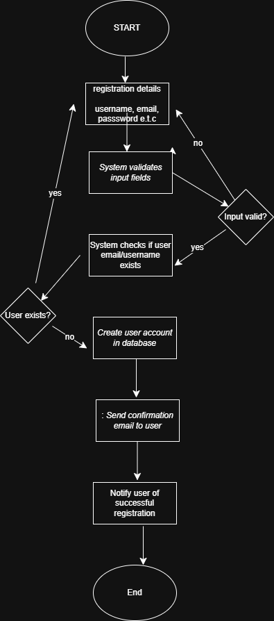

# Flowcharts

## User Registration Flowchart

This flowchart illustrates the step-by-step process of how a user registers on the Airbnb clone platform.

### Steps:

1. **Start**
2. **User fills registration form**
3. **System validates inputs**
   - If valid → proceed
   - If invalid → show error and return to form
4. **Create user account**
5. **Send confirmation email**
6. **Registration success**
7. **End**

The diagram helps developers and stakeholders understand the logical flow of user onboarding.

